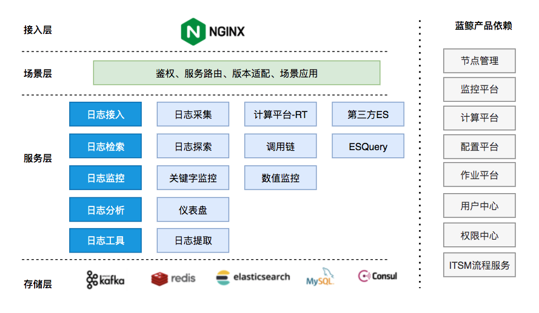

# 蓝鲸日志平台（BK-LOG）系统架构

蓝鲸日志平台（BK-LOG）是蓝鲸体系下的日志类SaaS，总体上可分成以下四层：
1. 接入层: 对外暴露访问接口
2. 场景层：负责用户鉴权、服务路由、场景化应用等用户交互
3. 服务层
   - 日志接入：支持服务器日志采集、计算平台-RT接入、第三方ES接入
   - 日志检索：实时日志探索、调用链视图、统一查询API
   - 日志监控：对接蓝鲸监控平台实现日志关键字监控、数值监控
   - 日志分析：基于grafana的仪表盘分析视图
   - 日志工具：通过JOB提取服务器日志文件
4. 存储层：关系型 MySQL 、用于日志检索 ElasticSearch、KV 型存储 Redis等

此外，右侧为平台依赖的蓝鲸产品，在 蓝鲸官网 可以找到对应产品的介绍。
