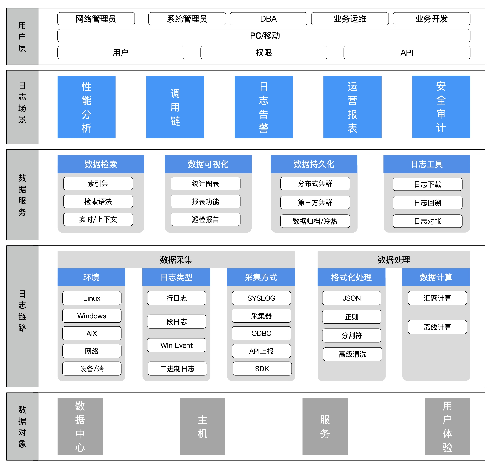

# 蓝鲸日志平台（BK-LOG）设计理念

蓝鲸日志平台（BK-LOG）是为解决分布式架构下日志收集、查询困难的一款日志产品，
基于业界主流的全文检索引擎，通过蓝鲸智云的专属 Agent 进行日志采集，
提供多种场景化的低门槛的采集、查询功能。

## 集成多渠道的日志数据
- 日志采集
- 蓝鲸计算平台ES源
- 第三方ES源

## 低门槛的日志服务
- 统一的日志采集器分发、部署、托管、保护
- 全日志的生命周期管理：索引分裂、冷热切换、日志归档
- 功能强大的日志服务：检索、上下文、实时日志等
- 丰富的日志使用场景: 调用链、仪表盘、日志监控等

## 扩展常用的日志工具
- 日志提取
- 日志查看

## 附：日志平台产品功能

