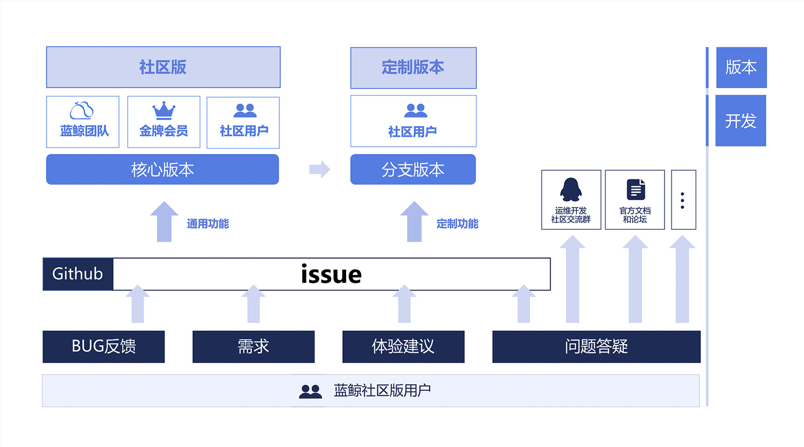

# 蓝鲸日志平台
## 导读
TODO

## 功能特性

## 定位与价值
TODO

## 社区
我们希望通过将蓝鲸日志平台开源，活跃运维开发圈子，促进运维开发同仁们技术交流，共同构建一个友好、活跃的社区，共同成长；相信在大家的加入和共同陪伴下，可以使运维开发社区变得更加强大、优秀。

## 关于开源协议
蓝鲸日志平台采用的是 MIT 开源协议。MIT 是和 BSD 一样宽泛的许可协议，作者只想保留版权，而无任何其他的限制。也就是说，你必须在你的发行版里包含原许可协议的声明。
## 欢迎一起交流

### 腾讯蓝鲸智云
腾讯蓝鲸智云体系由平台级产品和通用 SaaS 服务组成，平台包括管控平台、配置平台、作业平台、PaaS 平台、CI 平台、基础计算平台等，通用 SaaS 包括节点管理、标准运维、日志检索、蓝鲸监控、故障自愈等，为各种云（公有云、私有云、混合云）的用户提供不同场景、不同需求的一站式技术运营解决方案。

腾讯蓝鲸体系产品架构图-社区版

### 说明

1、腾讯蓝鲸是一个体系化产品，需要各产品整体配合使用，才能发挥最大的功能价值；

2、社区版中，目前开源的产品有：配置平台、PaaS 平台、标准运维、容器管理平台、CI 平台、基础计算平台；

3、配置平台、PaaS 平台可以作为原子平台单独部署使用；

4、标准运维、故障自愈必须跟整个体系配合使用。

### 开源产品链接
配置平台：https://github.com/Tencent/bk-cmdb

PaaS 平台：https://github.com/Tencent/bk-PaaS

标准运维：https://github.com/Tencent/bk-sops

CI 平台：https://github.com/Tencent/bk-ci

基础计算平台：https://github.com/Tencent/bk-base

容器管理平台：https://github.com/Tencent/bk-bcs

容器管理平台 SaaS：https://github.com/Tencent/bk-bcs-saas