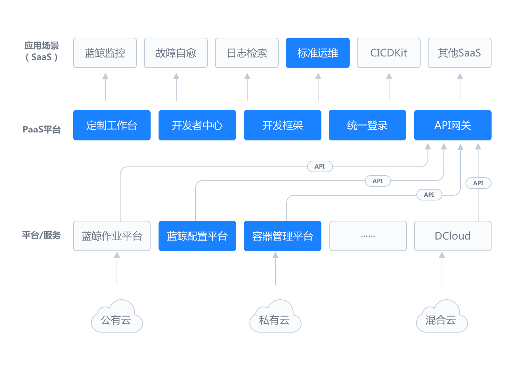

### 腾讯蓝鲸智云

腾讯蓝鲸智云是腾讯对外开放的一套支持私有化部署、永久免费的运维解决方案。该体系包含CMDB管理、作业脚本执行、流程编排、日志检索、监控告警、
故障自愈、微服务容器管理以及持续集成(CI)等能力，助力企业技术人员快速构建一体化运维支撑以及研发效能提升的能力，推动企业数字化转型。

腾讯蓝鲸体系产品架构图

### 说明：

1、腾讯蓝鲸是一个体系化产品，需要各产品整体配合使用，才能发挥最大的功能价值；
2、目前开源的产品有：配置平台、PaaS平台、作业 平台、容器管理平台、蓝盾（持续集成平台）、标准运维等；
3、配置平台、PaaS平台可以作为原子平台单独部署使用；
4、标准运维必须跟整个体系配合使用。

### 开源产品链接：

[BK-CMDB](https://github.com/Tencent/bk-cmdb)：蓝鲸配置平台（蓝鲸 CMDB）是一个面向资产及应用的企业级配置管理平台。

[BK-CI](https://github.com/Tencent/bk-ci)：蓝鲸持续集成平台是一个开源的持续集成和持续交付系统，可以轻松将你的研发流程呈现到你面前。

[BK-BCS](https://github.com/Tencent/bk-bcs)：蓝鲸容器管理平台是以容器技术为基础，为微服务业务提供编排管理的基础服务平台。

[BK-PaaS](https://github.com/Tencent/bk-paas)：蓝鲸 PaaS 平台是一个开放式的开发平台，让开发者可以方便快捷地创建、开发、部署和管理 SaaS 应用。

[BK-SOPS](https://github.com/Tencent/bk-sops)：标准运维（SOPS）是通过可视化的图形界面进行任务流程编排和执行的系统，是蓝鲸体系中一款轻量级的调度编排类 SaaS 产品。

[BK-JOB](https://github.com/Tencent/bk-job)   蓝鲸作业平台(Job)是一套运维脚本管理系统，具备海量任务并发处理能力。