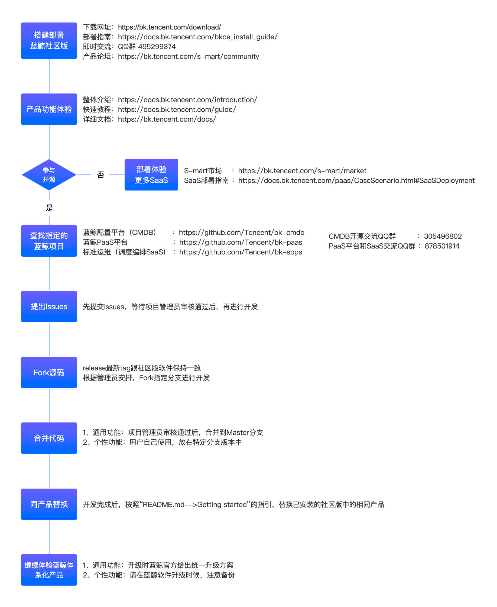

# 参与蓝鲸开源

## 图解快速共建蓝鲸开源项目

## 1. 搭建部署蓝鲸社区版

- [下载网址](https://bk.tencent.com/download/)
- [部署指南](https://docs.bk.tencent.com/bkce_install_guide/)
- [产品论坛](https://bk.tencent.com/s-mart/community)
- QQ 交流群:495299374

## 2. 产品功能体验
- [整体介绍](https://docs.bk.tencent.com/introduction/)
- [快速教程](https://docs.bk.tencent.com/guide/)
- [详细文档](https://bk.tencent.com/docs/)

## 3. 部署体验更多 SaaS
- [S-mart 市场](https://bk.tencent.com/s-mart/market)
- [SaaS 部署指南](https://docs.bk.tencent.com/paas/CaseScenario.html#SaaSDeployment)

## 4. 查找指定的蓝鲸项目
- [蓝鲸配置平台（CMDB）](https://github.com/Tencent/bk-cmdb)
- [蓝鲸 PaaS 平台](https://github.com/Tencent/bk-paas)
- [标准运维（调度编排 SaaS）](https://github.com/Tencent/bk-sops)
- CMDB 开源交流 QQ 群: 305496802
- PaaS 平台和 SaaS 交流 QQ 群: 878501914

## 5. 提出 Issues
先提交 Issues，等待项目管理员审核通过后，再进行开发

## 6. Fork 源码
release 最新 tag 跟社区版软件保持一致。根据管理员安排，Fork 指定分支进行开发。

## 7. 合并代码
- 通用功能：项目管理员审核通过后，合并到 Master 分支
- 个性功能：用户自己使用，放在特定分支版本中

##	8. 同产品替换
开发完成后，按照 [Getting started](../../README.md#getting-started) 的指引，替换已安装的社区版中的相同产品

##	9. 继续体验蓝鲸体系化产品

- 通用功能：升级时蓝鲸官方给出统一升级方案
- 个性功能：请在蓝鲸软件升级时候，注意备份